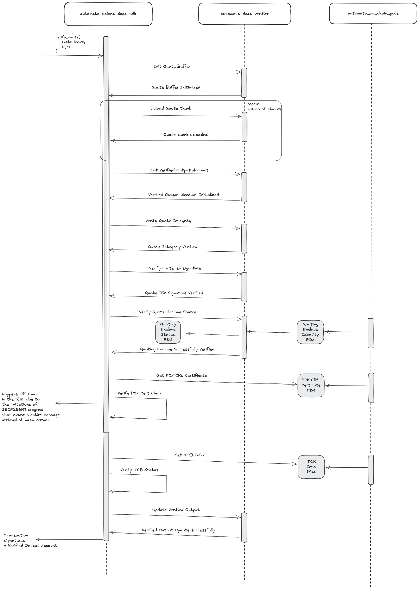

# Solana DCAP Attestation


Solana DCAP Attestation framework enables you to verify DCAP quote on Solana Chain.

## Architecture
The Solana DCAP Attestation Framework provides a comprehensive solution for verifying Intel SGX DCAP (Data Center Attestation Primitives) quotes on the Solana blockchain. The architecture consists of these key components:

1. SDK Layer: A client-side library that abstracts the complexity of interacting with the on-chain programs. It handles quote processing, communication with the blockchain, and verification workflow management.

2. On-Chain Programs:
    - DCAP Verifier Program: Handles the core verification logic, including quote integrity checks, ISV signature verification, and enclave source validation.
    - On-Chain PCCS: Provides Provisioning Certification Caching Service functionality, storing and managing certificates and enclave identity information required for attestation.
3. Verification Flow:
    - Quotes are broken into chunks due to Solana transaction size limitations
    - Data is stored in on-chain buffers (DataBuffer accounts)
    - Verification happens through a series of instruction calls that validate different aspects of the DCAP quote
    - Final verified output is stored in a VerifiedOutput account
4. Security Components:
    - Leverages Solana's secp256r1 program for cryptographic verification
    - Handles TCB (Trusted Computing Base) status validation
    - Verifies quote integrity, ISV signatures, and enclave identity against trusted sources

This architecture enables secure, on-chain attestation verification while handling the complexity of DCAP attestation within Solana's constraints.





## How to test on localnet ?

In order to test on localnet, please make sure you have the essential tools installed. The tools required are
- Solana CLI (Min required version is 2.2.1)
- Anchor CLI (Min required version is 0.31.0)

1. Setup your environment

```shell
solana-keygen new
solana config set --url localhost
```

2. Start a local test validator

```shell
solana-test-validator
```

3. Build and deploy the programs

```shell
cd solana/automata-dcap-framework
anchor build
anchor deploy
```

4. Once you have deployed the program, it is necessary for you to upload the required collateral to the PCCS program. The SDK provides with a PCCS Client, please refer to that and upload collateral.

5. Once you have uploaded required collateral you can call the `verify_dcap` quote function from the SDK.


## Why is it only available in LOCALNET ?

- At the moment of writing this, `secp256r1` pre-compiled program is only available in localnet and is not available in `devnet` and `testnet`
- Hence one can only test this in local environment.
