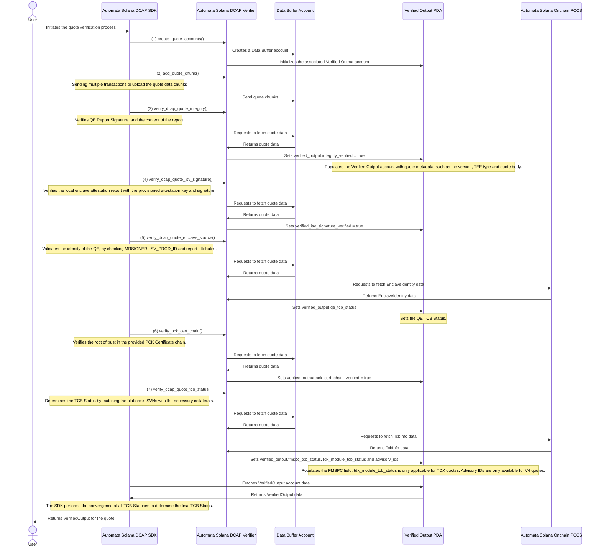

# Solana DCAP Attestation


Solana DCAP Attestation framework enables you to verify DCAP quote on Solana Chain.

## Architecture
The Solana DCAP Attestation Framework provides a comprehensive solution for verifying Intel SGX DCAP (Data Center Attestation Primitives) quotes on the Solana blockchain. The architecture consists of these key components:

1. SDK Layer: A client-side library that abstracts the complexity of interacting with the on-chain programs. It handles quote processing, communication with the blockchain, and verification workflow management.

2. On-Chain Programs:
    - Automata DCAP Verifier Program: Handles the core verification logic, including quote integrity checks, ISV signature verification, and enclave source validation.
    - Automata Onchain PCCS: Provides Provisioning Certification Caching Service functionality, storing and managing PCK Certificates, CAs and corresponding CRLs, and other information required (known as collaterals) for attestations.
3. Quote Verification Flow:
    - Quotes are broken into chunks due to [Solana transaction size limitations](https://solana.com/docs/core/transactions#transaction-size)
    - Data is stored in on-chain buffers (DataBuffer accounts)
    - Verification happens through a series of instruction calls that validate different aspects of the DCAP quote. The necessary instructions to complete a quote verification consist of (can be executed in any order):
        - ``verify_dcap_quote_integrity()``
        - ``verify_dcap_quote_isv_signature()``
        - ``verify_dcap_quote_enclave_source()``
        - ``verify_pck_cert_chain()``
        - ``verify_dcap_quote_tcb_status()``
    - Final verified output is stored in a VerifiedOutput account
4. Security Components:
    - Leverages Solana's [secp256r1 precompile](https://solana.com/docs/core/programs#secp256r1-program) (and zk-SNARK) for cryptographic verification
    - Handles TCB (Trusted Computing Base) status matching by checking SVNs from individual components:
        - Quoting Enclave (QE)
        - CPU SVNs found in the embedded PCK Certificate
        - TDX Module (TDX Quotes only)
    - Verifies quote integrity, ISV signatures, and enclave identity against trusted sources
5. Account closure:
    - At any point in time, users can close BOTH the data buffer and verified output accounts to re-claim rent.
    - Users are only able to **SIMULTANEOUSLY** close both the data buffer and verified output accounts (meaning one cannot exist without the other onchain). This is done so by executing the `close_quote_account` instruction in the Automata DCAP Verifier program.
    - Re-opening a data buffer account using a keypair for previously closed accounts is not possible. To re-verify a quote, users must use a new keypair, re-upload the data and repeat the verification process, i.e. all instructions listed on Step 3 must be executed.

This architecture enables secure, on-chain attestation verification while handling the complexity of DCAP attestation within Solana's constraints.

## Detailed: Quote Verification Flow

> ℹ️ **NOTE:**
> 
> This is a simplified sequence diagram showing the Automata Solana Onchain PCCS program as a single entity. In reality, the PCCS program derives corresponding PDAs to store collaterals for each DAOs (Data Access Object), e.g. an FMSPC TCB PDA representing FMSPC TCB DAO and etc...
> 




## How to test on localnet ?

In order to test on localnet, please make sure you have the essential tools installed. The tools required are
- Solana CLI (Min required version is 2.2.1)
- Anchor CLI (Min required version is 0.31.1)

1. Setup your environment

```shell
solana-keygen new
solana config set --url localhost
```

2. Start a local test validator

```shell
solana-test-validator
```

3. Build and deploy the programs

```shell
cd solana/automata-dcap-framework
anchor build
anchor deploy
```

4. Once you have deployed the program, it is necessary for you to upload the required collateral to the PCCS program. The SDK provides with a PCCS Client, please refer to that and upload collateral.

5. Once you have uploaded required collateral you can call the `verify_dcap` quote function from the SDK.

6. You may run the provided test suite using the following command:

```shell
anchor test
```

## Why is it only available in LOCALNET ?

At the moment of writing this, the `secp256r1` pre-compile is only available in localnet and is not available in `devnet` and `testnet`.
